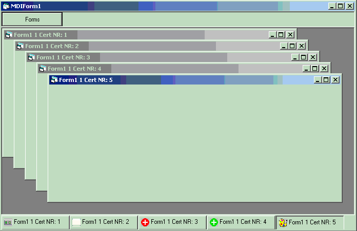



## FormBar

### Description

Ever wanted to create a tray bar for your MDIChild forms that looks like windows tray? or just tired to use Windows menu to switch beetween child forms? or just want to improve the looks of your app... Here is an example of how to create a form bar (a'la tray) to place in a mdi form.

it doesn't use any api to detect forms and stuff, only old fasion Visual Basic event model.

all u have to do is invoke ONE sub to add a form to the bar, and the rest will be done automatically. I have tested this control only in a MDI app, you are welcome to try its functionality in a SDI app, and leave your comments. Menu functions are not implemented fully, cause i couldn't decide how... Well u can add a custom menu, but control doesn't raise any event when a button is clicked. It's up to u to figure out and implement such functionality. Have fun (and rate!!!)
 
### More Info
 

             |
---                |---
**Submitted On**   |2002-04-17 11:36:16
**By**             |[Dmitriy \(DiMan\)](https://github.com/Planet-Source-Code/PSCIndex/blob/master/ByAuthor/dmitriy-diman.md)
**Level**          |Intermediate
**User Rating**    |4.4 (22 globes from 5 users)
**Compatibility**  |VB 6\.0
**Category**       |[Custom Controls/ Forms/  Menus](https://github.com/Planet-Source-Code/PSCIndex/blob/master/ByCategory/custom-controls-forms-menus__1-4.md)
**World**          |[Visual Basic](https://github.com/Planet-Source-Code/PSCIndex/blob/master/ByWorld/visual-basic.md)
**Archive File**   |[FormBar728224172002\.zip](https://github.com/Planet-Source-Code/dmitriy-diman-formbar__1-33876/archive/master.zip)

